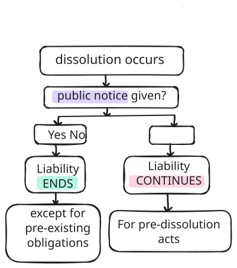

# Dissolution

### Sec 39 - Dissolution meaning

End of partnership between **all the partners** of a firm is called the dissolution of the firm.

> [!NOTE]
> Dissolution and Winding up are two different concepts.  Realisation of Assets and paying off liabilities are part of winding up, not of dissolution
> unless, contract[^deed] says otherwise.

### Sec. 40 - Dissolution by agreement

A partnership firm can be dissolved -
1. with the consent of all partners (i.e, unanimous consent)
2. according to a contract[^deed] between the parties

> [!Court Ruling]
>
> - mere cessation is not equal to dissolution.

[^deed]: means the original Partnership deed

### Sec. 41 - Compulsory dissolution

Grounds -
1. All partners declared as insolvent[^insolvency]
2. All partner except one[^min-two] declared as insolvent[^insolvency]
3. On happening of an event that makes it illegal to:
   - Carry on the business of the firm, OR
   - Carry it on in partnership

#### Examples
1. firm dealt in liquor, new law bans liquor sales
2.  a partner becomes an alien enemy during wartime

#### Exception

If the **firm carries more than one business**, the illegality of one or more won't cause dissolution. we can continue with the lawful businesses.

> [!NOTE]
> Dissolution is **automatic** when event occurs (no notice required)
>  Unlike Section 40, partners have no control here

> [!EXAMPLE]
> Suppose a firm have 10 partners
> - all 10 got declared as insolvent. No member remaining, hence dissolved.
> - 9 partners got declared as insolvent. Only one partner left. 1 won't make partnership, hence dissolved.
> - 8 partners got declared as insolvent. Now two partners left. 2 is enough to make partnership, hence **NOT** dissolved.

[^min-two]: Why "all except one"? Because partnership requires a minimum of two persons (Section 11)

[^insolvency]: Insolvency requires adjudication, not just financial trouble, but formal court declaration.

### Sec. 42 - Dissolution on the happenings of certain contingencies

> [!NOTE]
> These are default cases, which happens in absence of a contract between partners. The dissolution can be simply avoided by a provision in the partnership deed or by partners conduct.

The firm is dissolved -
1. if formed for a fixed term, by the expiry of that term;
2.  if constituted to carry out one or more business venture, by the completion thereof;
3. by the death of a partner; and
4. by the adjudication of a partner  as an insolvent.

> [!Court Ruling]
> An **express** agreement is not necessary, **it can be a implied one**. The conduct between the parties is sufficient to  infer that there is a contract between them that the partnership was not to be dissolved on the death of a partner.
>
> e.g., heirs stepping into a deceased partner's shoes on death, shows their intention to continue without dissolution.

### Sec. 43 - Dissolution by notice of partnership at will

A **partnerships at will** means:
- There is no fixed term for duration, AND
- There is no specific venture or undertaking

In such cases, the partnership can continue indefinitely, but any partner has the right to end it unilaterally by giving notice, in writing, to all the other partners, of his intention to dissolve the firm.

In short, sec. 43 says: give notice to partners -> firm dissolves. 

The firm is dissolved as from the date-
1. mentioned in the notice as the date of dissolution OR,
2. if no date is mentioned, as from the date of the communication of the notice.

> [!Court Ruling]
> Section 43 provides the standard procedure for dissolution(written notice = guaranteed). But, it is not the only way to dissolve a partnership at will. If no written notice was given, courts may still find dissolution based on substance over form. i.e, whether the partner's intention to dissolve was communicated through oral statements or conduct.

| mode of communication | dissolution | section |
| written notice | guaranteed (even if others object) | Sec. 43 (Unilateral Notice) |
| oral / conduct | possible (but ONLY if others agree/accept) | Sec. 40 (Mutual Agreement) |

Bare act uses the wording "**Does not control**", which simply means, Section 43 is not the only way to dissolve a partnership at will.

### Sec. 44 - Dissolution by the court

​A partner can file a suit in the court to dissolve the firm on any of the following 7 grounds.

If a partner has become -
    1. unsound mind; 
    2. incapable of performing his duties as partner; 

3. misconduct by a partner which is likely to damage the business operations or reputation.

4. willfully or repeatedly commits breach of agreements relating to- 
    - the management of the affairs of the firm or
    - the conduct of its business; or    
    - otherwise so conducts himself in matters relating to the business 

 making it practically impossible for others to work with him.

5. If a partner has in any way- 
    - transferred the whole of his interest in the firm to a third party; or 
    - has allowed his share to be charged or
    - has allowed to be sold in the recovery of the arrears of land revenue or
    - of any dues recoverable as arrears of land revenue due by the partner; 
6. The business is practically dead and cannot be carried on except at a continuous loss. 
7. Any other valid reason where court thinks it is fair to dissolve

> [!NOTE]
> In India, land revenue recovery is one of the most powerful way of recovering dues. The court sells the land and recovers the arrear. Additionally, many other laws provides for the same recovery mechanism for cases other than land revenue. Example, recovery of Gratuity amount not paid by employer withing 30 days it has become due, by the Collector.

> [!Court Ruling]
> it was held that to a suit for dissolution of partnership and rendition of accounts, all the partners and legal representatives of the deceased partner/partners are necessary parties. The suit is to be dismissed if a necessary party is not impleaded or is impleaded beyond the period of limitation.

#### adventure or undertaking

**undertaking** means essentially the same thing as "venture." They're paired together for legal completeness, not to denote two different categories. 

- Venture: 	Often implies risk, profit-seeking, commercial activity
- Undertaking:	Broader, can include non-profit tasks, obligations, or commitments

Together, they cover any defined project or task the partners agreed to complete.

In short, Any specific project or task that has a definable end point.

## After dissolution

### Sec. 45 - Liability of partners after dissolution

The liability of the partners will continue for the acts done before the dissolution, even after the dissolution, **until public notice is given** of the dissolution. 

The following partner is not liable for the acts after the date on which he ceases to be a partner(public notice not required)-
1. Deceased partner / his legal representative/estate;   
2. Partner adjudicated  insolvent;
3. Unknown retiring partner (third party didn't know them as partner) 

> [!Court Ruling]
> the legal representatives of a deceased partner cannot be held accountable for an action made by the surviving partner after dissolution caused by death.
> 
> Once the partnership is dissolved, mutual agency disappears. 

### Sec. 46 - Right of partners after dissolution

On the dissolution of a firm

1. the property of the firm applied in payment of the debts and liabilities of the firm and 

2. only after that, if there is any surplus, it gets distributed among the partners or their profit sharing ratio or as per the contract.

### Sec. 47 - Continuing authority of partners

after the dissolution of a firm
1. necessary to wind up the affairs of the firm
2.  to complete unfinished transactions

the authority of each partner to bind the firm and the other mutual rights and obligations of the partners continue, notwithstanding the dissolution, so far as may be necessary to wind up the affairs of the firm and to complete transactions begun but unfinished at the time of the dissolution, but not otherwise.

The firm is, in no case, bound by the acts of a partner who has been adjudicated insolvent. This will not affect the liability of any person who has, after the adjudication, represented himself, or knowingly permitted to be represented as partner of the insolvent.

### Sec. 48 - Mode of settlement [Default, in case of no provision regarding this matter in Partnership deed]

1. losses, including deficiencies of capital, shall be paid in this order -
    a. out of profits,
    b. out of capital and
    c. if necessary by the partners individually in the profit sharing ratio;

2. the firms assets (including capital deficiency contribution by partners) shall be applied in the following order-

| Order | Recipient |
|:------:|:---------|
| 1 | third parties creditors |
| 2 | partners for advances[^adv] (distinguished from capital) |
| 3 | partners for capital |
| 4 |   partners for any residue (in profit sharing ratio) |

[^adv]: Advances means money lent by partners to the firm (like a loan), distinct from their capital investment.

### Sec. 49 - Payment of firm debts

where there are joint debts due from the firm and also separate debts due from any partner, 

**the property of the firm** => 
1.  payment of the dues of the firm. 
2. If there is any surplus then the share of each partner[^share] shall be applied in payment of his separate debts or paid to him.

**The separate property of any partner** =>
1. payment of his separate debts and
2. the surplus, if any, for the payment of firm's debt.

> In short, whose property? their creditor first. Then only cross liability kicks in.

[^share]: share of each partner means his capital contribution and surplus. Partners Advances are already paid sec. 48

### Sec. 50 - Personal profits after dissolution

personal profits earned by any surviving/deceased partners representatives, from the moment the firm is dissolved to the moment the firm gets completely wound up, such personal profits shall be accounted to the firm.

If any partner or his representative has bought the goodwill of the firm, he shall have right to use the firm name.

*In short, right till the firm is fully wound up, every single penny earned from firms name/property/business connection/transactions is entitled to firm. Its like an extention to sec. 16*

related sections: 16, 47, 53

### Sec. 51 - Return of premium

**Case**: partner paid a premium for a fixed term partnership and it dissolved before term otherwise than by the death of the partner.

partner is entitled to get repayment of the premium, reasonable to the duration of his participation and remaining time,  unless-

1. the dissolution is mainly due to his own misconduct; or	
2. the agreement between parties deny the return of the premium or any part of it.

### Sec. 52 - Rescinding of contract

When partnership is rescinded[^rescinded] due to fraud or misrepresentation, the defrauded party gets three rights:

| Right |	Description |
|:----|:------|
| 1. Lien on/right of retention of Surplus | 	Retain amount paid for share(same as premium paid when joining) + capital contribution from remaining assets after debts |
| 2. Creditor Status	 | in respect of any payment made by him towards the debts of the firm |
|3. Indemnity |	Fraudulent partner(s) must indemnify against ALL firm debts |

[^rescinded]: rescinded means to make void **OR** to cut off

### Sec. 53 - Restrain to use firm name

1. From dissolution till the Firm is completely wound up, in absence of a contract, any partner or his representative can restrain any other partner from carrying on a similar business in the firm name, or from using any of the property of the firm for his own benefit. 

> [!NOTE]
> The **contract** can be Any mutually agreed arrangement between partners 
on post-dissolution rights that overrides Section 53 defaults

2. Where any partner or his representative has brought the goodwill of the firm he has the right to use the firm name.

> [!Court Ruling]
> in order to exercise an option under Section 53
> - firm must be dissolved and after dissolution of the firm contract has to be seen. 
 
The object of this section is to restrain a partner from doing anything which reduces the saleable value of the property, while liquidating.

### Sec. 54 - Agreements in restraint of trade

This is a statutory exception to Section 27 of Indian Contract Act (which voids restraint of trade).

- agreement upon or in anticipation of the dissolution of the Firm (this timing is important)
- some or all of them will not carry on a business similar to that of them within a specified period of within the specified local limits
- valid only if the restrictions imposed in the agreement are reasonable.

> [!Court Ruling]
> Restriction in agreement: Entire world except Karachi - void.
> 
> Restrictions imposed in the agreement must be reasonable.

