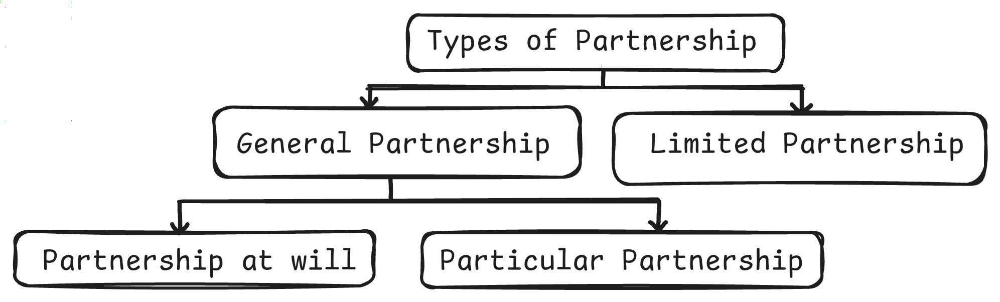

# Introduction

### Sec. 4 - Definitions

partnership
    : as the relationship between persons who have agreed to share the profits of a business carried on by all or any of them acting for all. 

partners
    : is defined as persons, who have entered into partnership with one another are called individually partners. 

firm
    : is the collective of the partners. 

firm name
    : is the name under which the business is carried on.

#### Essential ingredients for the constitution of a partnership-

- There should be an agreement between the parties;	
- The agreement must be to share the profits of the business; and	
- The business must be carried on by all or any of them acting for all;	
- The existence of a mutual agency
- The agreement can be in writing or oral. It may be express of implied.

A nominal partner can be of two types -
1. Partner by estoppels - A person who by his words (spoken or written) represents himself as a partner
2. partner by holding out - conduct represents himself as a partner

Both becomes liable to those who advance money to the firm on the basis of such representation. He cannot avoid the consequences of his previous act.

### Sec. 5 - Partnership is a creation of contract

The relation of partnership arises from contract and not from status.

i.e, For example, In a HUF carrying on a family business, one become member just by being born in that family. Its not a contract but a status. Hence its not a partnership.

The partnership is entirely different from a company, Limited Liability partnership, Hindu Undivided Family.

### Partnership Types

1. On the basis of Liability
   - General Partnership
   - Limited Partnership
1. On the basis of Duration
   - Partnership at will
   - Particular Partnership

### Difference between General Partnership and Limited Partnership

| Basis                  | General Partnership                                                                  | Limited Partnership                                                                                                                                  |
| :--------------------- | :----------------------------------------------------------------------------------- | ---------------------------------------------------------------------------------------------------------------------------------------------------- |
| governing act          | Indian Partnership act, 1932                                                         | Limited liability partnership Act, 2008                                                                                                              |
| liability              | unlimited, except for minor partner (limited only to his share of capital and profit | will have at least **one** partner with unlimited liability **and** some partner with limited liability who won't be able to take part in management |
| artificial person      | No                                                                                   | Yes                                                                                                                                                  |
| mandatory registration | no                                                                                   | yes                                                                                                                                                  |

### Difference between Partnership at will and Particular Partnership

| Basis                                               | Partnership at will (Sec. 7)                                                                                                                        | Particular Partnership (Sec. 8)                                                                                       |
| :-------------------------------------------------- | :----------------------------------------------------------------------------------------------------------------------------------------- | ------------------------------------------------------------------------------------------------------------ |
|                                                     | formed for an indefinite period                                                                                                            | Formed for a specific time period or a specific purpose                                                      |
| Mentioned in agreement at the time of its formation | time period or purpose **is not** mentioned.                                                                                               | time period or purpose **is** mentioned.                                                                     |
| dissolution                                         | depending upon the will of the partners, can be dissolved by any partner by giving notice to other partners on his desire to quit the firm | automatic dissolution on the expiry of the specific time period or on the completion of the specific purpose |

#### Sec. 7 - Date of dissolution when partner gives notice

On such notice being given, the firm is dissolved from the date mentioned in the notice. If no such date is mentioned, as from the date of communication of the notice.

#### Sec. 7 - Essential ingredients of Partnership at Will

It's not **Partnership at will**, If the partnership deed contains any provision (expressed or implied)
1. duration of partnership AND
2. for the determination of the partnership

> In short, Partnership that's not "Particular Partnership" is "Partnership at will"

### Types of Partners

| Type              | Contributes Capital | Takes parts in Mngt. | Known to public | Liability                     | Special Point                              |
| :---------------- | ------------------- | -------------------- | --------------- | ----------------------------- | ------------------------------------------ |
| Active/Working    | yes                 | yes                  | yes             | unlimited                     | shares profits and losses of firm          |
| Sleeping/Dormant  | yes                 | no                   | no              | unlimited                     | shares profits and losses of firm          |
| Secret            | yes                 | yes                  | no              | unlimited                     | shares profits and losses of firm          |
| Limited           | yes                 | no                   | possible        | limited to share & profit     |                                            |
| Partner in Profit | yes (or goodwill)   | no                   | possible        | unlimited                     | shares profits only                        |
| Nominal           | no                  | no                   | yes             | unlimited (to outsiders only) | Does not shares profits and losses of firm |
| Minor             | yes                 | no                   | possible        | limited to share & profit     | Shares profits only                        |

