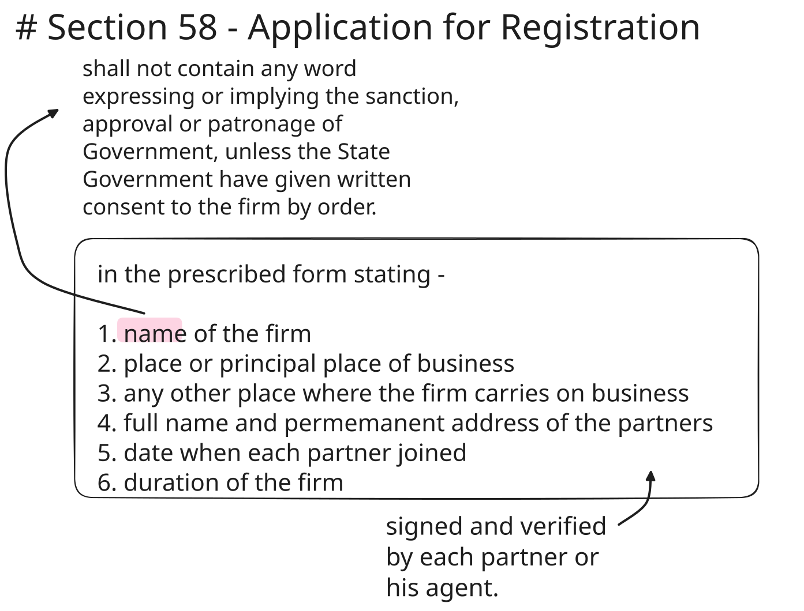

## Powers of State Government

### Sec. 56 - Exemption from the Act

State Government:
- can give exemption from the provisions of this Act
- fully or any part of state
- by notification in the Official Gazette

### Sec. 57 - Registrars of the Firm

State Government:
- appoints Registrar of firms &
- define the area within which they exercise their power and perform their duties

### Sec. 71 - Determination of fees

State Government:
- may determine fees and conditions

## Registration

### Sec. 58 - Application for registration

contents of statement:

1. Name of the firm
2. Place, or principal place of the business
3. Name[^firm_name] of any other place where the firm carries on business
4. Date when each partner joined
5. Full name & permanent address of the partners
6. duration

Signed and verified by all the partner/agent.

[^firm_name]: name must not contain any word expressing or implying the sanction or approval or patronage of Government, unless State Government gives consent by order in writing.

### Sec. 59 - Registrars duty on receiving statement

On receiving the statement, if satisfied with the provisions of sec 58, the Registrar 
1. Record an entry of the statement in the Register of Firms
2. File the statement

## Sec. 60–65 - Alterations in Register of Firms

On satisfying relevant provision Registrar will amend the entry & files the statement/intimation.

| Sec. | Business Change  | Required action                                                                           | who?                                                                                                                            |
| ---- | :-------------------------------------------------- | ----------------------------------------------------------------------------------------- | ------------------------------------------------------------------------------------------------------------------------------- |
| 60   | Name/Place                                          | sent statement specifying the alteration, signed and verified + fee                       | any partner/agent                                                                                                               |
| 61   | New/Closed branch (not principal place)             | sent intimation note                                                                      | any partner/agent                                                                                                               |
| 62   | Partners name/permanent address                     | sent intimation note                                                                      | any partner/agent                                                                                                               |
| 63   | Constitution of a Firm changes/ Withdrawal of minor | give official notice of such change/dissolution, specifying the date of change/dissolution | incoming/outgoing/continuing partner **and** in case of dissolved firm any person who was partner immediately before dissolution |
| 64   | Rectification of mistake                            | Registrar can rectify mistakes to match original docs.                                     | registrar                                                                                                                       |
| 65   | any Amendment by order of Court                     | court direct registrar to amend entries                                                   | court order                                                                                                                     |

##### Withdrawal of a Minor

when a minor who has been admitted to the benefits of the partnership firm, attains majority and elects -
- to become a partner
- not to become a partner

​Should give notice to Registrar. Failing to do so within 6 months will make him a partner.

​Notice to the Registrar regarding this election must be given by the minor himself (now a major) or by his authorized agent.

<!-- fact check above points -->>

### Sec. 66–68 and 70 - effects of registration

From sec 58 - 63, we talked about statement, amending statement, notice, and intimation.Such documents recorded/noted in the Register of Firms

- is open to all
     - **Sec. 66** - pay fee + ?conditions[^sg_conditions] - inspect
     - **Sec. 67** - application + fee - will get certified copy of any entry or portion
- **Sec. 68** - becomes conclusive proof of facts
- **Sec. 70** - any person who signs any of the above said documents in fraudulent[^fraud] manner.
     - imprisonment up to 3 months OR
     - fine OR
     - both

[^sg_conditions]: State Government determines fees and conditions

[^fraud]: Contains any particular, which he knows to be false or does not believe to be true, or containing particular which he knows to be incomplete or does not believe to be complete

### Sec. 69 - effects of non registration

> [!NOTE]
> Registration of a partnership is optional in India, but Section 69 imposes severe disabilities on unregistered firms, as a result of which firms go for compulsory registration

The consequences of non-registration of a firm are as under;

1. No suit against Firm/Co-partners
2. No suit against 3rd parties
3. No right to Set-off

#### 1. No suit against Firm/Co-partners

A partner cannot sue the firm or any other partner to enforce a right arising from a contract or conferred by the Partnership Act.

#### 2. No suit against 3rd parties

The firm cannot sue third parties to enforce a right arising from a contract. 

> [!IMPORTANT]
> In both case 1 and 2, to sue -
> 1. Firm must be registered AND
> 2. the person suing is or has been shown in the Register of Firms as a partner in the firm.

#### 3. No right to Set-off

3. The provisions of sub-sections (1) and (2) shall apply also to claim of set- off or other proceeding to enforce a right arising from contract

> [!EXAMPLE]
> Suppose an unregistered Firm ABC bought ₹50,000 worth of raw materials from Zayn. Previously Zayn had borrowed ₹20,000 from the firm.  Now Zayn files a suit to recover his ₹50,000. In this situation, the firm can't set off the ₹20,000 and pay the balance of ₹30,000 to Zayn.  The firm must pay the full ₹50,000 to Zayn.
Now, if Zayn is not paying back the ₹20,000, the firm can't sue him either.

> [!NOTE]
> **Exceptions to Section 69:**
>
> The disabilities of non-registration shall **NOT** affect:
>
> 1. The right of partners to sue for dissolution of the firm or for the accounts/realization of property of a dissolved firm. or
> 2. the powers of an official assignee, receiver or Court to realize the property of an insolvent partner.
> 3. The right of third parties to sue the firm or its partners.

### Sec. 72 - mode of giving public notice

Wherever the act says to give public notice, it means publication -
1. in the Official Gazette and
2. in at least one vernacular newspaper[^newspaper]

but if it is regarding -
 - retirement/removal of a partner from a registered firm
 - dissolution of a registered firm
 - to notify the status of minor after attaining majority

We have to do one more thing

3. Notice to the Registrar of Firms

[^newspaper]: Newspaper circulating in the district where the firm, to which it relates, has its place or principal place of business;